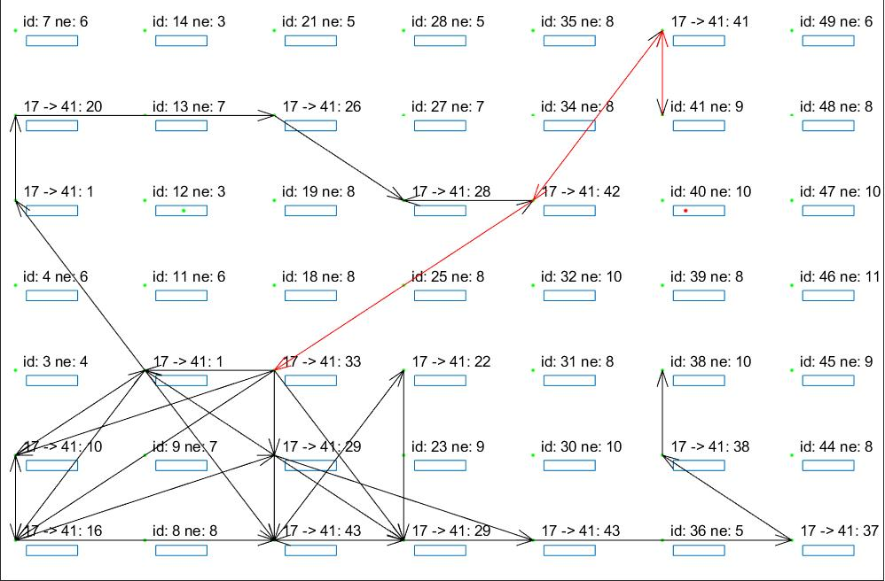
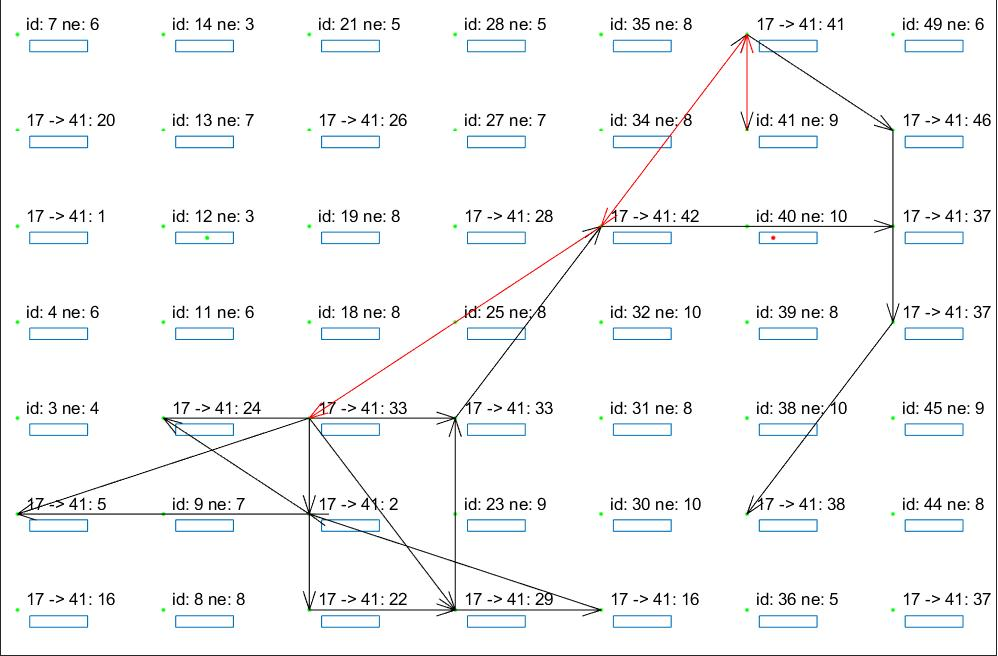
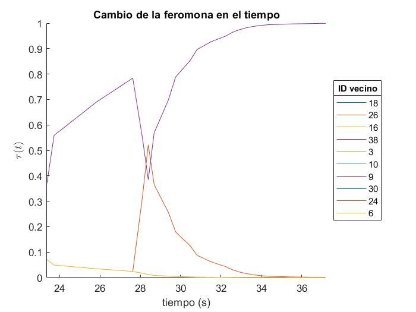
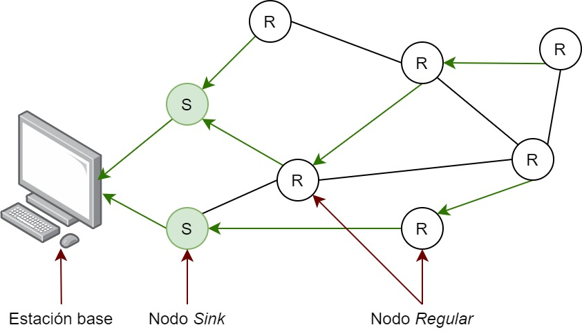
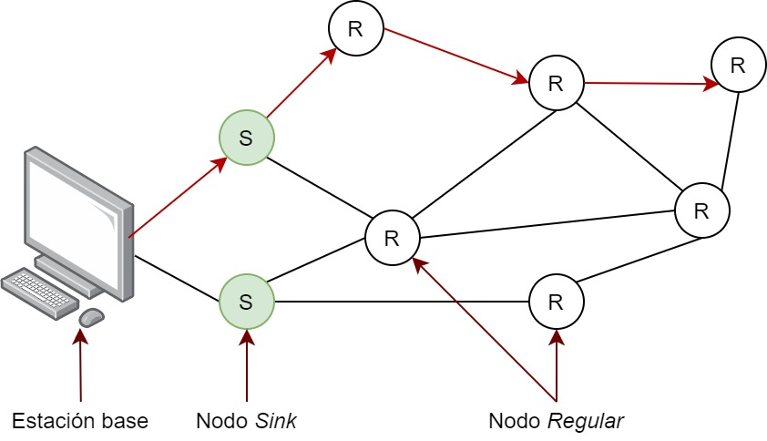
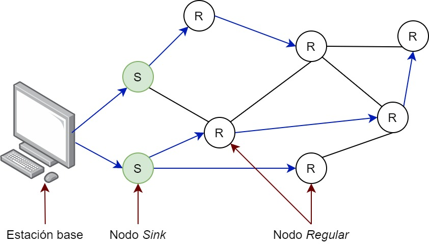

## Algoritmos de Enrutamiento Basados en Inteligencia de Enjambre

Este es el repositorio del trabajo de graduación dedicado a algoritmos de ruteo basados en inteligencia de enjambre, en particular ANTNET. Las carpetas principales son:
- documentos: tiene los archivos de MATLAB que implementan RMASE (_Routing Modelling Application Simulation Environment_).
- documentos_curso: contiene el documento de tesis y el artículo escrito para el curso
- imagenes: fólder para las imágnes que se presentan en los archivmos README
- red fisica: contiene los archivos de la implementacion fisica del algoritmo AntNet

## Ilustración de algunos gráficas de evolución de la feromona en el tiempo, desarrollado en Matlab
 
 
 
 

## Ilustración de los modos de comunicación a investigar con la implementación física
Recolección 
 

Control 
 

_Flooding_ 
 

[//]: # (These are reference links used in the body of this note and get stripped out when the markdown processor does its job. There is no need to format nicely because it shouldn't be seen. Thanks SO - http://stackoverflow.com/questions/4823468/store-comments-in-markdown-syntax)

   [dill]: <https://github.com/joemccann/dillinger>
   [git-repo-url]: <https://github.com/joemccann/dillinger.git>
   [john gruber]: <http://daringfireball.net>
   [df1]: <http://daringfireball.net/projects/markdown/>
   [markdown-it]: <https://github.com/markdown-it/markdown-it>
   [Ace Editor]: <http://ace.ajax.org>
   [node.js]: <http://nodejs.org>
   [Twitter Bootstrap]: <http://twitter.github.com/bootstrap/>
   [jQuery]: <http://jquery.com>
   [@tjholowaychuk]: <http://twitter.com/tjholowaychuk>
   [express]: <http://expressjs.com>
   [AngularJS]: <http://angularjs.org>
   [Gulp]: <http://gulpjs.com>

   [PlDb]: <https://github.com/joemccann/dillinger/tree/master/plugins/dropbox/README.md>
   [PlGh]: <https://github.com/joemccann/dillinger/tree/master/plugins/github/README.md>
   [PlGd]: <https://github.com/joemccann/dillinger/tree/master/plugins/googledrive/README.md>
   [PlOd]: <https://github.com/joemccann/dillinger/tree/master/plugins/onedrive/README.md>
   [PlMe]: <https://github.com/joemccann/dillinger/tree/master/plugins/medium/README.md>
   [PlGa]: <https://github.com/RahulHP/dillinger/blob/master/plugins/googleanalytics/README.md>
